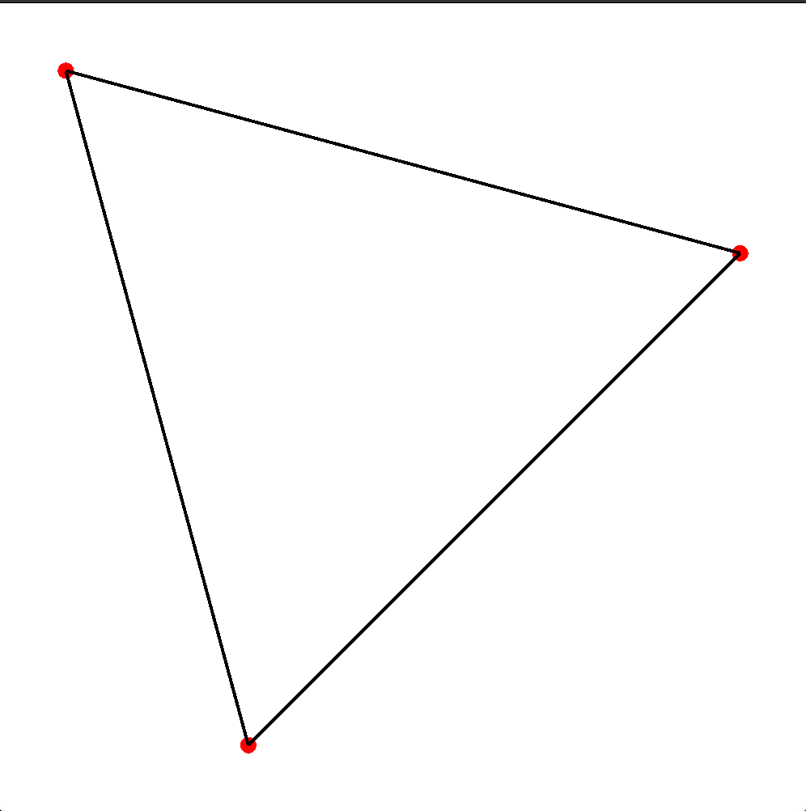
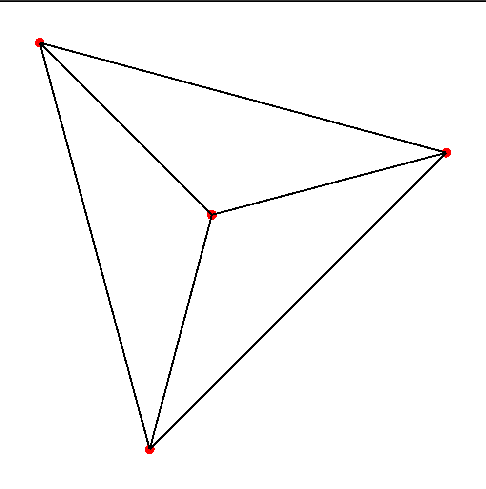
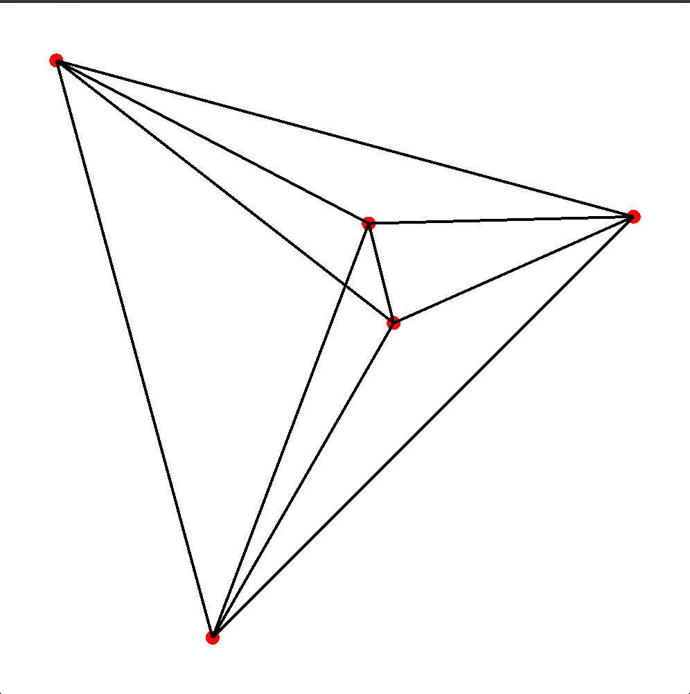
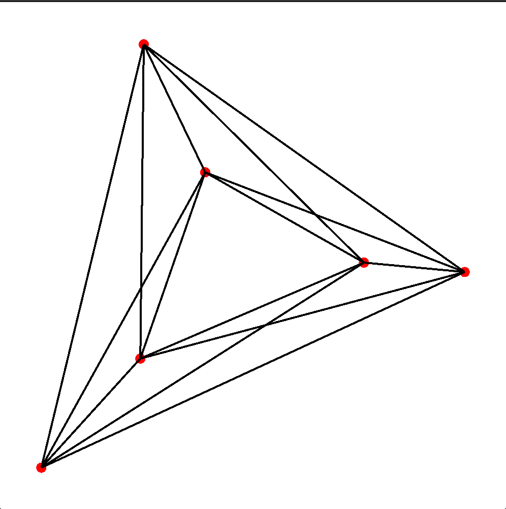
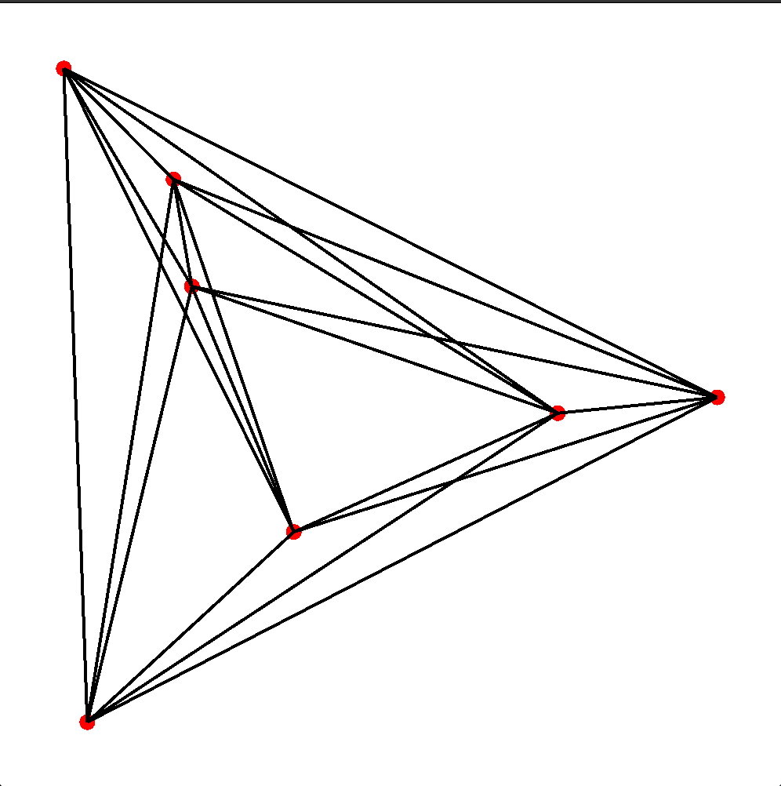
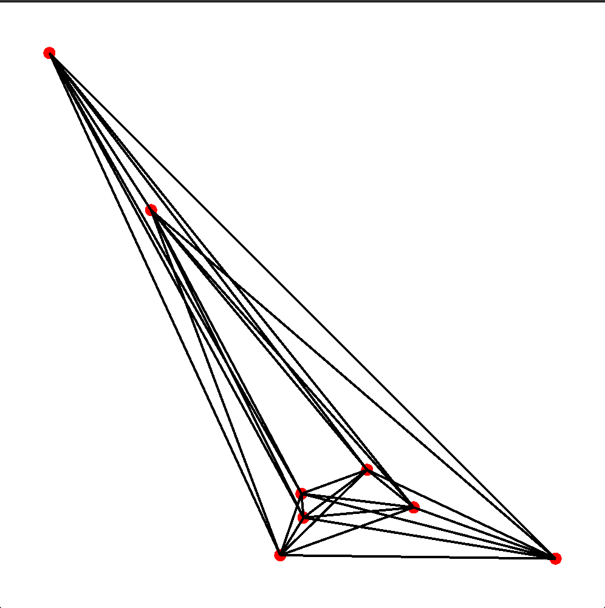
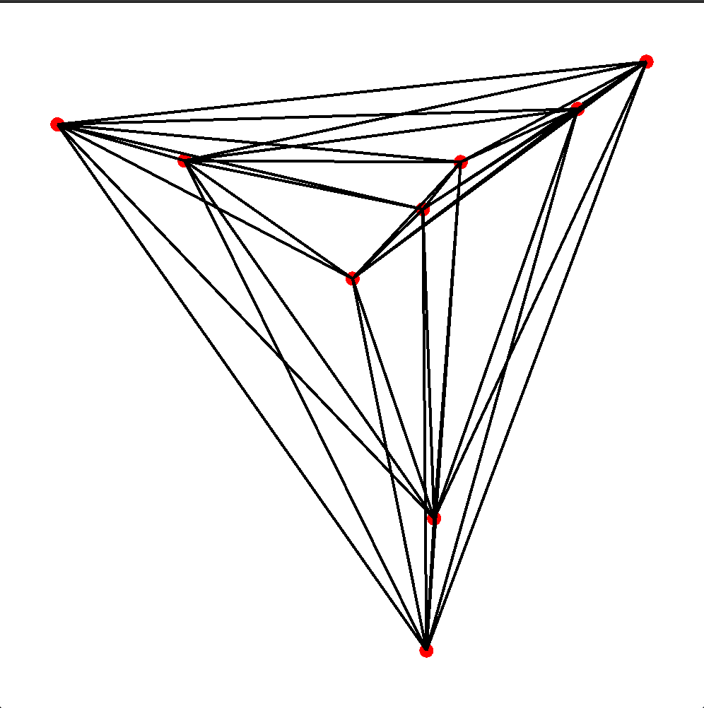

Using this [data](http://www.ist.tugraz.at/staff/aichholzer/research/rp/triangulations/ordertypes/), a "rust-viewer" of the point-set configurations with maximal number of crossing-free hamiltonian cycles

